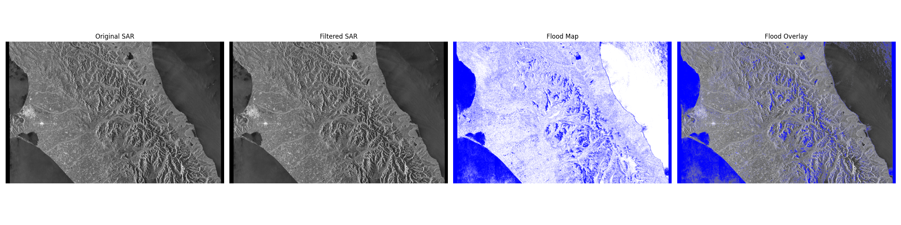

# Ashburton Flood SAR Analysis

This project aims to analyze the flood event in the Ashburton, New Zealand area using Sentinel-1 Synthetic Aperture Radar (SAR) data. The workflow involves downloading pre- and post-flood imagery, storing it in a PostGIS database, and preparing it for analysis.

## Prerequisites

Before you begin, ensure you have the following installed:
- [Docker Desktop](https://www.docker.com/products/docker-desktop/)
- [Python 3.8+](https://www.python.org/downloads/)
- [Git](https://git-scm.com/downloads/)

## Project Setup

Follow these steps to get your local development environment set up.

### 1. Clone the Repository
```bash
git clone <your-repository-url>
cd ashburton_flood_sar_analysis
```

### 2. Authentication and Configuration

This project requires two separate configuration steps: authentication for ASF data access and configuration for the local database.

#### ASF Authentication (`.netrc` file)

To download data from the Alaska Satellite Facility (ASF), you must provide your Earthdata Login credentials via a `.netrc` file. This is a standard method for providing credentials to command-line utilities.

1.  Create a new text file.
2.  Add the following lines, replacing `YOUR_USERNAME` and `YOUR_PASSWORD` with your actual Earthdata Login credentials.

    ```
    machine urs.earthdata.nasa.gov
      login YOUR_USERNAME
      password YOUR_PASSWORD
    ```

3.  Save the file in your user home directory with the name `_netrc` (on Windows) or `.netrc` (on macOS/Linux).
    - **Windows Path:** `C:\Users\<Your-Username>\_netrc`
    - **macOS/Linux Path:** `~/.netrc`

The script will automatically use this file for authentication.

#### Local Database Configuration (`.env` file)

Create a file named `.env` in the root of the project to configure the local PostGIS database that will be run by Docker.

Populate the `.env` file with the following content:

```env
# Configuration for the local PostGIS database
POSTGRES_DB=ashburton_db
POSTGRES_USER=docker_user
POSTGRES_PASSWORD=your_secure_password
```

### 3. Launch the PostGIS Database
This project uses Docker to provide a consistent and isolated PostGIS environment.

With Docker Desktop running, execute the following command from the project root:
```bash
docker-compose up -d
```
This command will download the PostGIS image (on the first run) and start a database container in the background. You can verify that the container is running with `docker ps`.

### 4. Set up Python Environment
It is highly recommended to use a Python virtual environment to manage project dependencies.

```bash
# Create and activate the virtual environment
python -m venv venv
.\venv\Scripts\Activate.ps1

# Install the required packages
pip install -r requirements.txt
```

## Usage

Due to persistent authentication issues with the `asf-search` API, data acquisition is currently a manual process.

### 1. Manual Data Acquisition

#### 1.1. Download Zip Archives
Go to the [ASF Search website](https://search.asf.alaska.edu/) and manually download the following two scenes. Save the resulting `.zip` files into the `data/` directory.

-   **Pre-flood Scene:**
    -   **Search Dates:** `2021-05-01` to `2021-05-15`
    -   **File to Download:** The `L1 Detected High-Res Dual-Pol (GRD-HD)` product with a large file size (approx. 894 MB).
    -   **Example Filename:** `S1A_IW_GRDH_1SDV_20210511T173943_20210511T174008_037843_047769_94F3.zip`

-   **Post-flood Scene:**
    -   **Search Dates:** `2021-05-20` to `2021-06-05`
    -   **File to Download:** The `L1 Detected High-Res Dual-Pol (GRD-HD)` product with a large file size.
    -   **Example Filename:** `S1A_IW_GRDH_1SDV_20210604T173944_20210604T174009_038193_0481EC_793C.zip`

#### 1.2. Unzip the Archives
The downloaded `.zip` files must be unzipped. The recommended way to ensure they are extracted to the correct location is to first navigate into the `data` directory.

```powershell
# Navigate into the data directory from the project root
cd data

# Unzip the pre-flood data
Expand-Archive S1A_IW_GRDH_1SDV_20210511T173943_20210511T174008_037843_047769_94F3.zip

# Unzip the post-flood data
Expand-Archive S1A_IW_GRDH_1SDV_20210604T173944_20210604T174009_038193_0481EC_793C.zip

# Return to the project root
cd ..
```

This will create two `.SAFE` directories inside the `data` folder.

### 2. SAR Data Processing

The `scripts/process_sar.py` script handles the initial processing of the downloaded SAR data. It performs the following steps:

1.  **Reads SAR TIFF data**: Uses `rasterio` to read the raw SAR imagery.
2.  **Radiometric Calibration**: Converts the raw Digital Numbers (DNs) to physically meaningful backscatter coefficients.
3.  **Speckle Filtering**: Applies a median filter to reduce speckle noise, which is common in SAR imagery.
4.  **Change Detection (Downsampled for Processing)**: Compares pre-flood and post-flood processed data (downsampled to manage memory) to identify areas of significant change, indicating potential flooding.
5.  **Histogram Analysis**: Generates a histogram of the ratio image (clipped for better visualization) to assist in refining the flood detection threshold. This will help you visually identify a suitable threshold.
6.  **Automated Threshold Selection**: Uses Otsu's method on a clipped version of the ratio image to automatically determine an optimal threshold for flood detection based on the ratio image histogram.
7.  **Georeferencing**: Extracts georeferencing information from the SAR product's annotation XML files to ensure the output is spatially accurate.
8.  **Visualization**: Displays the original SAR data, filtered data, and the detected flood map using `matplotlib`. Visualizations are downsampled for display and use improved color mapping for clarity.
9.  **Export GeoTIFF**: Exports the final georeferenced flood map as a GeoTIFF file, which can be used in GIS software.

To run the SAR data processing script, ensure your Python virtual environment is activated and execute:

```bash
python scripts/process_sar.py
```

### 3. Import Data into PostGIS

This section details how to import the generated flood map GeoTIFF (`results/flood_map_change_detection.tif`) into your PostGIS database.

**1. Ensure your PostGIS container is running:**
If it's not already running, start your PostGIS container using:
```bash
docker-compose up -d
```

**2. Run the `raster2pgsql` command:**

You have two main options for running `raster2pgsql`:

**Option A: Run `raster2pgsql` from your host machine (recommended if `raster2pgsql` is installed locally):**

```bash
raster2pgsql -s 4326 -I -C -M results/flood_map_change_detection.tif public.flood_map | psql -h localhost -p 5432 -U docker_user -d ashburton_db
```

**Explanation of the command:**
-   `raster2pgsql`: The PostGIS raster loader utility.
-   `-s 4326`: Specifies the Spatial Reference ID (SRID) as 4326 (WGS 84), which matches the CRS of your GeoTIFF.
-   `-I`: Creates a GiST index on the raster column for faster spatial queries.
-   `-C`: Applies raster constraints (e.g., spatial extent, resolution) to the table.
-   `-M`: Sets the metadata for the raster.
-   `results/flood_map_change_detection.tif`: The path to your generated flood map GeoTIFF.
-   `public.flood_map`: The schema and table name where the raster data will be imported.
-   `|`: Pipes the output of `raster2pgsql` to `psql`.
-   `psql`: The PostgreSQL command-line client.
-   `-h localhost`: Connects to the PostgreSQL database running on your local machine (via Docker's port forwarding).
-   `-p 5432`: Connects to the database on port 5432.
-   `-U docker_user`: Connects as the user `docker_user` (from your `.env` file).
-   `-d ashburton_db`: Connects to the database named `ashburton_db` (from your `.env` file).

When prompted for the password, enter `P@ssw0rd123!`.

**Option B: Run `raster2pgsql` from within the `ashburton_postgis` Docker container (if `raster2pgsql` is not installed on your host or you prefer this method):**

First, copy the GeoTIFF into the container:
```bash
docker cp results/flood_map_change_detection.tif ashburton_postgis:/tmp/flood_map_change_detection.tif
```

Then, execute the `raster2pgsql` command inside the container:
```bash
docker exec -it ashburton_postgis bash -c "/usr/bin/raster2pgsql -s 4326 -I -C -M /tmp/flood_map_change_detection.tif public.flood_map | psql -U docker_user -d ashburton_db"
```
When prompted for the password, enter `P@ssw0rd123!`.

**Important Note on `raster2pgsql` path:**
As mentioned in the `README.md`, if you encounter an "executable file not found" error when running `raster2pgsql` directly, you might need to provide the full path to the executable. For example, if running inside the PostGIS container, it might be `/usr/bin/raster2pgsql`.

After successfully importing the data, you can connect to your PostGIS database using `psql` and verify the import:
```bash
psql -h localhost -p 5432 -U docker_user -d ashburton_db
```
Enter the password `P@ssw0rd123!`.
Then, within the `psql` prompt, run:
```sql
\d flood_map;
SELECT count(*) FROM flood_map;
```

### 4. Analyze Data

Once the flood map raster data is imported into PostGIS, you can perform various spatial analyses using SQL queries. Here are some examples:

**1. Connect to your PostGIS database:**
```bash
psql -h localhost -p 5432 -U docker_user -d ashburton_db
```
Enter the password `P@ssw0rd123!`.

**2. Calculate the total flooded area:**

Assuming your `flood_map` table contains raster data where pixel values of `1` represent flooded areas and `0` represent non-flooded areas, you can calculate the total flooded area.

First, you might want to get the pixel size in square meters (or appropriate units) if your raster is in a projected CRS. Since our `flood_map` is in `EPSG:4326` (latitude/longitude), direct area calculation of pixels can be complex and is usually done after reprojecting to a projected CRS. However, for a rough estimate or if the area is small enough, you can use `ST_Area` on the raster geometry.

Let's assume for simplicity that each pixel represents a certain area. If you want to calculate the number of flooded pixels:

```sql
SELECT SUM((ST_DumpAsPolygons(rast)).geom IS NOT NULL AND (ST_DumpAsPolygons(rast)).val = 1) AS flooded_pixel_count
FROM flood_map;
```

To get a more accurate area, you would typically reproject the raster to a suitable projected CRS (e.g., a local UTM zone) and then calculate the area. For example, if you reproject to `EPSG:2193` (NZGD2000 / New Zealand Transverse Mercator):

```sql
-- This is a conceptual query. Reprojection of raster data can be resource-intensive.
-- You might need to create a reprojected raster table first.
SELECT SUM(ST_Area(ST_Transform((ST_DumpAsPolygons(rast)).geom, 2193))) AS total_flooded_area_sq_m
FROM flood_map
WHERE (ST_DumpAsPolygons(rast)).val = 1;
```

**3. Visualize the data in a GIS client:**

Connect to your PostGIS database from a GIS client like QGIS. You can add the `flood_map` table as a PostGIS raster layer and visualize the flooded areas. This allows for interactive exploration and overlay with other geographic datasets.

### 5. Results Visualization and Interpretation

Here, we present a key visualization of the flood detection results. This image shows the comparison between pre-flood and post-flood SAR imagery, with the detected flood areas overlaid.



**Interpretation:**
The visualization above highlights the areas identified as flooded by the SAR change detection process. Typically, areas appearing in blue indicate water bodies or newly inundated regions. By comparing the pre-flood and post-flood imagery, one can observe the extent and location of the flood event. This visual output is crucial for understanding the impact of the flood and can be further analyzed in GIS software for detailed assessment.

## Skills Demonstrated

This project is a practical exercise in a modern geospatial data analysis workflow. Completing it demonstrates a range of valuable skills for data engineering, GIS, and data science roles:

*   **Data Engineering:**
    *   Containerized database setup using Docker and PostGIS, demonstrating DevOps principles for consistent environments.
    *   Data pipeline development: acquiring data from an external API and loading it into a spatial database.
    *   Management of authentication credentials for scientific data archives.

*   **Geospatial Analysis & Remote Sensing:**
    *   Handling and processing of Synthetic Aperture Radar (SAR) data (Sentinel-1).
    *   Application of remote sensing techniques to a real-world problem (flood mapping).

*   **Modern Development Practices & Problem-Solving:**
    *   Python scripting with dependency management (`venv`, `requirements.txt`).
    *   Systematic debugging of complex authentication and API issues.
    *   Clear documentation of setup and processes (`README.md`).

## Future Work

This project provides a solid foundation for SAR-based flood analysis. Potential future enhancements include:

*   **Machine Learning/Deep Learning for Flood Detection:** Explore the application of advanced machine learning or deep learning models (e.g., U-Net, Random Forest) to improve flood detection accuracy and robustness, especially in complex environments or with varying SAR characteristics. This would involve training models on labeled flood data.
*   **Integration with Real-time Data Feeds:** Connect to real-time or near real-time SAR data feeds for more timely flood monitoring.
*   **Advanced Geospatial Analysis:** Incorporate more sophisticated PostGIS queries for spatial statistics, flood impact assessment (e.g., overlay with population data, infrastructure), and hydrological modeling.
*   **Web-based Visualization:** Develop a web application for interactive visualization of flood maps and analysis results.

## Troubleshooting

Here are some common issues you might encounter and their solutions:

### 1. `docker: command not found`

**Issue:** When trying to run `docker` commands (e.g., `docker-compose`, `docker cp`, `docker exec`), you receive an error like `bash: line 1: docker: command not found`.

**Solution:** This indicates that the Docker CLI is not installed or not accessible in your system's PATH.
*   Ensure Docker Desktop is installed and running on your system.
*   Verify that the Docker CLI tools are correctly added to your system's PATH environment variable. You might need to restart your terminal or computer after installation.

### 2. `ERROR: type "raster" does not exist` during `raster2pgsql` import

**Issue:** When attempting to import raster data using `raster2pgsql`, you encounter an error indicating that the `raster` type does not exist.

**Solution:** This means the PostGIS raster extension (`postgis_raster`) is not enabled in your database.
*   Connect to your PostGIS database (e.g., using `psql` inside the Docker container: `docker exec -it ashburton_postgis psql -U docker_user -d ashburton_db`).
*   Execute the SQL command to enable the extension: `CREATE EXTENSION postgis_raster;`
*   Then, retry the `raster2pgsql` import command.

### 3. `ERROR: relation "flood_map" already exists` during `raster2pgsql` import

**Issue:** When re-running the `raster2pgsql` command, you get an error that the `flood_map` table already exists.

**Solution:** This happens because `raster2pgsql` with the `-C` option tries to create the table, but it's already there from a previous import.
*   **Option A (Drop and Recreate):** If you want to completely replace the existing data, drop the table first:
    *   Connect to your PostGIS database.
    *   Execute the SQL command: `DROP TABLE IF EXISTS flood_map;`
    *   Then, retry the `raster2pgsql` import command.
*   **Option B (Append Data):** If you want to add new raster data to the existing table (and the schema matches), you can use the `-a` (append) option instead of `-C` in your `raster2pgsql` command. However, for updating the same flood map, dropping and recreating is usually cleaner.

### 4. `rasterio.errors.CRSError: PROJ: proj_create_from_database: Cannot find proj.db`

**Issue:** When running `python scripts/process_sar.py`, you encounter an error related to `proj.db` not being found, or a version mismatch (e.g., `DATABASE.LAYOUT.VERSION.MINOR = 0 whereas a number >= 4 is expected`).

**Solution:** This indicates a problem with the PROJ data files required by `rasterio` (via `pyproj`). The `proj.db` file is either missing, in an incompatible version, or not discoverable by your Python environment.

*   **Step 1: Copy compatible PROJ data from the Docker container.**
    The PostGIS Docker container (`ashburton_postgis`) contains a compatible PROJ installation. You can copy its data files to your virtual environment:
    ```bash
    docker cp ashburton_postgis:/usr/share/proj/ venv/share/proj/
    ```
*   **Step 2: Unset the `PROJ_LIB` environment variable.**
    If you previously tried to set `PROJ_LIB`, unset it to allow `pyproj` to correctly find its data files within the `venv`:
    ```powershell
    $env:PROJ_LIB=""
    ```
    (Or close and reopen your terminal if you set it for the session.)
*   **Step 3: Re-run the script.**
    After performing the above steps, run the processing script again:
    ```bash
    python scripts/process_sar.py
    ```