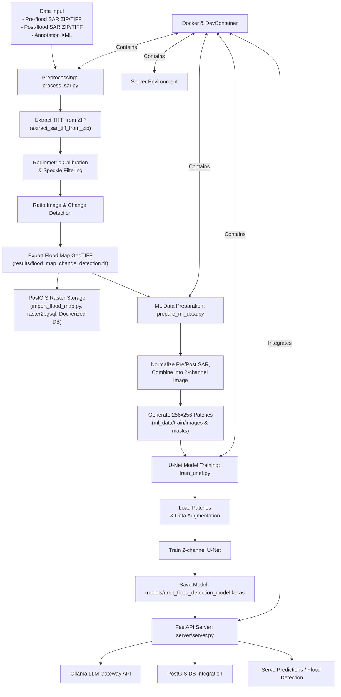

# 🌊 Ashburton Flood SAR Analysis

## 🛰️ Overview
This project implements an end-to-end pipeline to detect flood-affected areas in the **Ashburton region (Canterbury, NZ)** by analyzing **Sentinel-1 SAR imagery** from the May–June 2021 flood event.

It combines advanced geospatial data preprocessing, deep learning, and a robust, containerized architecture to deliver actionable flood mapping and analysis.

---

## ✨ Key Features

*   **End-to-End Geospatial Workflow:** From raw Sentinel-1 imagery to a final flood map, the entire pipeline is automated, including radiometric calibration, speckle filtering, and change detection. These preprocessing steps are crucial for accurate SAR analysis by correcting sensor biases and reducing noise.
*   **Deep Learning for Flood Prediction:** A 2-channel U-Net model (Keras/TensorFlow) is trained to accurately predict flood extent from pre- and post-flood SAR images.
*   **GPU Accelerated Processing:** Leverages NVIDIA CUDA via `server/Dockerfile.python` for accelerated SAR data processing and deep learning model training (TensorFlow).
*   **Containerized & Reproducible Environment:** The entire stack—including the processing environment, a PostGIS database, and a FastAPI server—is containerized with Docker, ensuring seamless setup and reproducibility.
*   **Efficient Raster Data Management:** Utilizes a PostGIS database for efficient storage, tiling, and querying of large-scale geospatial raster data.
*   **Modular & API-Driven:** Designed with a modular architecture that can be extended for API-based analysis and integration with other systems.

---

## 🛠️ Technologies
Python, FastAPI, Docker, PostGIS, Rasterio, GDAL, Keras/TensorFlow (U-Net), scikit-image, NumPy, Sentinel-1 SAR.

---

## 📊 Project Flowchart


---

## 🐳 Setup & Quickstart

### 1️⃣ Prerequisites
- Docker and Docker Compose
- Sentinel-1 `.SAFE` data folders

### 2️⃣ Environment Setup
Create a `.env` file in the project root with the path to your data directory. This approach, combined with Docker volumes, ensures cross-OS compatibility (e.g., Windows, Linux) by standardizing the path within the container.

```
DATA_DIR=/app/data
```

### 3️⃣ Place Sentinel-1 Data
Place your unzipped `.SAFE` folders into the directory you specified above (e.g., a `data/` folder in the project root). The structure should look like this:
```
data/
├─ S1A_IW_GRDH_1SDV_20210511Txxxxxx.SAFE/
│ └─ measurement/*.tiff
├─ S1A_IW_GRDH_1SDV_20210604Txxxxxx.SAFE/
│ ├─ measurement/*.tiff
│ └─ annotation/*.xml
```

### 4️⃣ Build and Run
Build the main analysis image and run the processing script.
```bash
# 1. Build the Docker image
docker build -t sar-analysis -f server/Dockerfile.python .

# 2. Run the container with volumes for data and results
# This will automatically start the processing script
docker run --rm \
  -v ${PWD}/data:/app/data \
  -v ${PWD}/results:/app/results \
  sar-analysis
```
You should see logs indicating the script is running and saving its outputs.

---

## 🔬 Running the Full ML Pipeline

After completing the initial setup, you can run the full machine learning pipeline step-by-step inside the Docker container.

**Step 1: Enter the Docker Container**

First, start an interactive shell inside the `sar_analysis` container.

```bash
# Build the image if you haven\'t already
docker-compose build sar_processing

# Run a container with an interactive shell
docker-compose run --rm sar_processing bash
```

**Step 2: Preprocess SAR Data**

This step is like cleaning and preparing the raw satellite images. It makes them ready for analysis by correcting distortions and reducing noise. Finally, it creates a basic flood map by comparing "before" and "after" images to see where changes occurred.

```bash
# Inside the container
python server/process_sar.py
```

**Step 3: Prepare Data for Machine Learning**

Here, we take the prepared images and cut them into smaller, manageable pieces (called "patches"). These patches are then organized in a way that our U-Net machine learning model can easily learn from them to identify flood patterns.

```bash
# Inside the container
python scripts/prepare_ml_data.py
```
> **Note:** This script processes very large images and can take a significant amount of time to complete. You may see a "Resizing..." message, which is a normal alignment step. The process is finished when you see the "ML data preparation complete." message.

**Step 4: Train the U-Net Model**

In this step, the U-Net model learns to recognize flood patterns by looking at the many image patches we prepared. It's like teaching a computer to distinguish between flooded and non-flooded areas. Once it's done learning, the trained model is saved so we can use it later for predictions.

You can run this either by entering the container first (as in Step 1) and then executing the script, or more directly from your host machine:

```bash
# Option 1: Inside the container (after Step 1)
python scripts/train_unet.py
```

```bash
# Option 2: Directly from your host machine
docker compose run --rm sar_processing python scripts/train_unet.py
```

**Step 5: Predict with the Trained Model (Optional)**

After the model has learned, this step uses it to find flooded areas in new, unseen satellite images. This generates the final, more accurate flood maps based on the model's intelligence. This involves stitching together the predictions from individual image patches to reconstruct the full flood map.

```bash
# Inside the container
python scripts/predict_ml_flood.py

**Step 6: Convert Prediction to PNG for Visualization**

To easily visualize the flood prediction, convert the output GeoTIFF to a PNG image. This PNG can then be used in documentation or for quick viewing.

```bash
# Inside the container
# Convert U-Net prediction GeoTIFF to PNG
python scripts/convert_geotiff_to_png.py /app/results/flood_map_unet_prediction.tif /app/results/flood_map_unet_prediction.png

# Convert Change Detection GeoTIFF to PNG
python scripts/convert_geotiff_to_png.py /app/results/flood_map_change_detection.tif /app/results/flood_map_change_detection.png
```
```

## 📂 Project Structure
```
.
├── scripts/                  # Utility scripts for data prep, db import, and training
│   ├── import_flood_map.py   # Imports flood map GeoTIFF into PostGIS
│   ├── prepare_ml_data.py    # Prepares data for ML training (patching, channel combining)
│   └── train_unet.py         # U-Net model training script
├── server/                   # Main processing logic and FastAPI backend
│   ├── process_sar.py        # Main SAR preprocessing pipeline
│   ├── Dockerfile.python     # Dockerfile for the Python + GDAL processing environment
│   └── requirements-sar.txt  # Python dependencies for SAR processing
├── data/                     # Raw SAR data (e.g., .SAFE folders) - Ignored by Git
├── results/                  # Output of processing (e.g., flood maps) - Ignored by Git
├── models/                   # Trained machine learning models - Ignored by Git
├── docker-compose.yml        # Defines multi-container Docker application (including PostGIS)
└── README.md                 # Project overview and documentation
```

---

## 📊 Outputs & Results

This analysis generates several key outputs, which are saved in the `results/` directory.

### 1. Flood Maps (PNG & GeoTIFF)

The primary output is a georeferenced flood map that precisely delineates the inundated areas. We provide both the raw GeoTIFF and a PNG visualization for easier viewing.

| File                                     | Description                                          |
| :--------------------------------------- | :--------------------------------------------------- |
| `results/flood_map_change_detection.tif` | Final georeferenced flood extent map (GeoTIFF format) from change detection. |
| `results/flood_map_unet_prediction.tif`  | Final georeferenced flood extent map (GeoTIFF format) from U-Net prediction. |

#### Visualizations:

**Change Detection Flood Map:**


**U-Net Prediction Flood Map:**


### 2. Visual Analysis (`Figure_1.png`)

To provide a clear visual summary, the script generates a comparison image that includes the original SAR data, the filtered data, the binary flood map, and an overlay of the flood map on the original imagery.


### 3. Change-Detection Histogram (`histogram.png`)

A histogram of the ratio image is created to help analyze the distribution of change between the pre- and post-flood images. This is useful for fine-tuning the change detection threshold.


---

## 🧠 Key Functions & Technical Notes
- **`process_in_chunks()`**: Processes large SAR images in smaller chunks to minimize memory overflow, a common issue with geospatial raster data.
- **`sar_denoise()`**: Applies a median filter (`scikit-image`) to reduce speckle noise inherent in SAR imagery.
- **`parse_annotation_xml()`**: Reads GCPs and pixel spacing from Sentinel-1 metadata to ensure correct georeferencing.
- **`export_geotiff()`**: Writes the final flood map to a compressed, georeferenced GeoTIFF file using Rasterio.
- **PROJ_LIB Environment**: The Dockerfile sets `ENV PROJ_LIB=/usr/share/proj` to prevent common `CRSError` issues with Rasterio by ensuring it can find the projection database.

---

## 🧭 Future Improvements
- ✅ **Enhanced GPU Acceleration:** Explore integrating CuPy or PyTorch for further accelerating filtering and processing beyond current TensorFlow GPU capabilities.
- ✅ **AOI Clipping:** Add a feature to clip the analysis to a specific Area of Interest (AOI) using a shapefile or PostGIS geometry.
- ✅ **API Integration:** Fully integrate the processing pipeline with the FastAPI backend to allow for on-demand flood analysis via API calls.

---

## 🧠 GPU Support (Optional)

### Requirements
- Docker Desktop (with GPU support enabled)
- NVIDIA Driver **>= 535**
- NVIDIA Container Toolkit (see [installation guide](https://docs.nvidia.com/datacenter/cloud-native/container-toolkit/latest/install-guide.html))

### Initial GPU Setup

To enable GPU acceleration for Docker containers, follow these steps:

1.  **Install NVIDIA Container Toolkit and Choose a CUDA Base Image:**
    Follow the official [installation guide](https://docs.nvidia.com/datacenter/cloud-native/container-toolkit/latest/install-guide.html) for your specific Linux distribution. This tool allows Docker to interact with your NVIDIA GPU.

    Additionally, ensure your `Dockerfile` (e.g., `server/Dockerfile.python`) uses a currently recommended NVIDIA CUDA base image. You can find the latest supported images on the [NVIDIA CUDA Docker Hub page](https://hub.docker.com/r/nvidia/cuda/tags). For example, `nvidia/cuda:13.0.1-runtime-ubuntu24.04` is a recent choice. Avoid deprecated images like `nvidia/cuda:11.0-base`.

2.  **Restart Docker Daemon:**
    After installing the NVIDIA Container Toolkit, you need to restart your Docker daemon to apply the changes.
    *   **If using Docker Desktop (Windows/macOS):** Right-click the Docker Desktop icon in the system tray/menubar and select "Restart".
    *   **If using native Linux Docker:** Run `sudo systemctl restart docker`. (Note: If `systemctl` is not found, you might need to restart your system or Docker service via other means, e.g., restarting your WSL instance if applicable).

3.  **Verify GPU Setup:**
    Run the following command to confirm that Docker recognizes your GPU:
    ```bash
    docker run --rm --gpus all nvidia/cuda:12.6.2-base-ubuntu22.04 nvidia-smi
    ```
    You should see output similar to the example below, listing your NVIDIA GPU. If you see your GPU listed, your environment is ready.

    Additionally, when running the U-Net training script (`python scripts/train_unet.py`) inside the `sar_processing` container, look for a TensorFlow log message similar to this, confirming GPU detection:
    ```
    I0000 ... Created device /job:localhost/replica:0/task:0/device:GPU:0 with ... MB memory: -> device: 0, name: NVIDIA GeForce RTX 4060 Laptop GPU, pci bus id: ...
    ```
    This message explicitly confirms that TensorFlow is utilizing your GPU.


---

## ⚖️ License
MIT License © 2025

---

## 👤 Author
Developed by **Taka**  
Canterbury, New Zealand  
*Specializing in Geospatial Data Science, Network & Cloud Technology, and Remote Sensing*

---

## ⚠️ Common Docker Issues

### Port is already allocated (e.g., 0.0.0.0:5432 failed)

This error occurs when a port that a Docker container is trying to use on your host machine is already in use by another process (either another Docker container or a process outside of Docker).

**To resolve this:**

1.  **Identify the conflicting process:**
    *   **On Windows (PowerShell):**
        ```powershell
        netstat -ano | findstr :<PORT_NUMBER>
        ```
        Replace `<PORT_NUMBER>` with the port reported in the error (e.g., `5432`). This will show you the PID (Process ID) of the process using that port.
    *   **On Linux/macOS (Terminal):**
        ```bash
        sudo lsof -i :<PORT_NUMBER>
        ```
        This will show you the process using the port.

2.  **Stop the conflicting process:**
    *   **If it's another Docker container:**
        Navigate to the directory of the Docker Compose project that is running the conflicting container and run `docker compose down`.
        Alternatively, you can stop the specific container using its ID or name: `docker stop <CONTAINER_ID_OR_NAME>`.
    *   **If it's a process outside of Docker:**
        *   **On Windows (PowerShell):**
            ```powershell
            taskkill /PID <PID> /F
            ```
            Replace `<PID>` with the Process ID found in step 1.
        *   **On Linux/macOS (Terminal):**
            ```bash
            kill -9 <PID>
            ```
            Replace `<PID>` with the Process ID found in step 1.

3.  **Change the port mapping (Alternative Solution):**
    If you cannot stop the conflicting process, you can modify your `docker-compose.yml` file to map the container's port to a different, unused port on your host machine.

    For example, if `postgis` is trying to use host port `5432` and it's allocated, you can change its `ports` entry in `docker-compose.yml` from:
    ```yaml
        ports:
          - "5432:5432"
    ```
    to (using `5433` as an example):
    ```yaml
        ports:
          - "5433:5432"
    ```
    **Note:** For *this* project (`ashburton_flood_sar_analysis`), the `postgis` service has been configured to use host port `5433` (i.e., `5433:5432`) to avoid common conflicts.

After making any changes, try running `docker compose up` again.

---

## ⚠️ Troubleshooting

Here are some common issues you might encounter and their solutions:

### 1. `python: not found` error when running scripts in `sar_processing` container

**Issue:** You might see an error like `/opt/nvidia/nvidia_entrypoint.sh: line 67: exec: python: not found` when trying to run Python scripts (e.g., `train_unet.py`) inside the `sar_processing` Docker container. This happens because the `Dockerfile.python` installs `python3`, but some commands or scripts might implicitly look for `python`.

**Solution:** Modify `server/Dockerfile.python` to create a symbolic link from `python` to `python3`.

1.  Open `server/Dockerfile.python`.
2.  Locate the `RUN apt-get update ... python3 python3-pip ...` line.
3.  Add the following line immediately after it:
    ```dockerfile
    RUN ln -sf /usr/bin/python3 /usr/bin/python
    ```
    The relevant part of your `Dockerfile.python` should look like this:
    ```dockerfile
    RUN apt-get update && apt-get install -y --no-install-recommends \
        python3 python3-pip \
        gdal-bin libgdal-dev \
        proj-bin proj-data \
        && rm -rf /var/lib/apt/lists/*
    RUN ln -sf /usr/bin/python3 /usr/bin/python # Add this line
    ```
4.  Rebuild the `sar_processing` service to apply the changes:
    ```bash
    docker compose build sar_processing
    ```
5.  Then, try running your script again.

### 2. `sar_processing` service exits immediately or is not running

**Issue:** The `sar_processing` service might start and then immediately exit, or `docker compose ps` shows it's not running, even after `docker compose up -d sar_processing` was executed. This prevents you from running scripts with `docker compose exec`.

**Solution:** To diagnose why the service is exiting, you need to check its logs.

1.  **Check service status:**
    ```bash
    docker compose ps
    ```
    Confirm that `sar_processing` (or `sar_analysis`) is not listed as "Up".

2.  **Check service logs for errors:**
    ```bash
    docker compose logs sar_processing
    ```
    Look for any error messages in the output that indicate why the container stopped.

3.  **Run interactively for live debugging:**
    If logs are not clear, run the service in an interactive shell to debug directly:
    ```bash
    docker compose run --rm sar_processing bash
    ```
    Once inside the container (you'll see a prompt like `root@...:/app#`), you can manually try to execute commands or your script (e.g., `python /app/scripts/train_unet.py`) to see the error messages directly.
