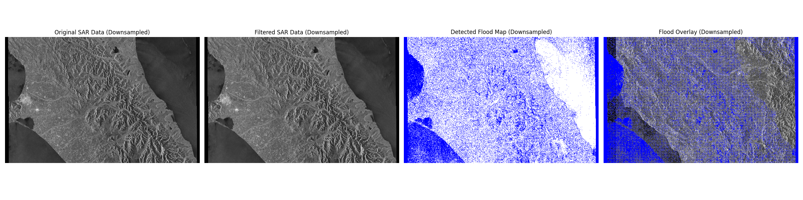

# 🌊 Ashburton Flood SAR Analysis

## 🛰️ Overview
This project implements an end-to-end pipeline to detect flood-affected areas in the **Ashburton region (Canterbury, NZ)** by analyzing **Sentinel-1 SAR imagery** from the May–June 2021 flood event.

It combines advanced geospatial data preprocessing, deep learning, and a robust, containerized architecture to deliver actionable flood mapping and analysis.

---

## ✨ Key Features

*   **End-to-End Geospatial Workflow:** From raw Sentinel-1 imagery to a final flood map, the entire pipeline is automated, including radiometric calibration, speckle filtering, and change detection.
*   **Deep Learning for Flood Prediction:** A 2-channel U-Net model (Keras/TensorFlow) is trained to accurately predict flood extent from pre- and post-flood SAR images.
*   **Containerized & Reproducible Environment:** The entire stack—including the processing environment, a PostGIS database, and a FastAPI server—is containerized with Docker, ensuring seamless setup and reproducibility.
*   **Efficient Raster Data Management:** Utilizes a PostGIS database for efficient storage, tiling, and querying of large-scale geospatial raster data.
*   **Modular & API-Driven:** Designed with a modular architecture that can be extended for API-based analysis and integration with other systems.

---

## 🛠️ Technologies
Python, FastAPI, Docker, PostGIS, Rasterio, GDAL, Keras/TensorFlow (U-Net), scikit-image, NumPy, Sentinel-1 SAR.

---

## 📊 Project Flowchart
```mermaid
flowchart TD
    %% Data Input
    A["Data Input<br>- Pre-flood SAR ZIP/TIFF<br>- Post-flood SAR ZIP/TIFF<br>- Annotation XML"] --> B["Preprocessing: process_sar.py"]

    %% Preprocessing steps
    B --> B0["Extract TIFF from ZIP<br>(extract_sar_tiff_from_zip)"]
    B0 --> B1["Radiometric Calibration & Speckle Filtering"]
    B1 --> B2["Ratio Image & Change Detection"]
    B2 --> B3["Export Flood Map GeoTIFF<br>(results/flood_map_change_detection.tif)"]

    %% PostGIS Raster Storage (for analysis/visualization)
    B3 --> B4["PostGIS Raster Storage<br>(import_flood_map.py, raster2pgsql, Dockerized DB)"]

    %% ML Data Preparation (from results/ TIFFs)
    B3 --> C["ML Data Preparation: prepare_ml_data.py"]
    C --> C1["Normalize Pre/Post SAR, Combine into 2-channel Image"]
    C1 --> C2["Generate 256x256 Patches<br>(ml_data/train/images & masks)"]

    %% U-Net Training
    C2 --> D["U-Net Model Training: train_unet.py"]
    D --> D1["Load Patches & Data Augmentation"]
    D1 --> D2["Train 2-channel U-Net"]
    D2 --> D3["Save Model: models/unet_flood_detection_model.keras"]

    %% API / Server
    D3 --> E["FastAPI Server: server/server.py"]
    E --> E1["Ollama LLM Gateway API"]
    E --> E2["PostGIS DB Integration"]
    E --> E3["Serve Predictions / Flood Detection"]

    %% Docker Integration
    F["Docker & DevContainer"]<-->|Integrates| E
    F <-->|Contains| D
    F <-->|Contains| C
    F <-->|Contains| B
    F <-->|Contains| Server Environment
```

---

## 🐳 Setup & Quickstart

### 1️⃣ Prerequisites
- Docker and Docker Compose
- Sentinel-1 `.SAFE` data folders

### 2️⃣ Environment Setup
Create a `.env` file in the project root with the path to your data directory:
```
DATA_DIR=/app/data
```

### 3️⃣ Place Sentinel-1 Data
Place your unzipped `.SAFE` folders into the directory you specified above (e.g., a `data/` folder in the project root). The structure should look like this:
```
data/
├─ S1A_IW_GRDH_1SDV_20210511Txxxxxx.SAFE/
│ └─ measurement/*.tiff
├─ S1A_IW_GRDH_1SDV_20210604Txxxxxx.SAFE/
│ ├─ measurement/*.tiff
│ └─ annotation/*.xml
```

### 4️⃣ Build and Run
Build the main analysis image and run the processing script.
```bash
# 1. Build the Docker image
docker build -t sar-analysis -f server/Dockerfile.python .

# 2. Run the container with volumes for data and results
# This will automatically start the processing script
docker run --rm \
  -v ${PWD}/data:/app/data \
  -v ${PWD}/results:/app/results \
  sar-analysis
```
You should see logs indicating the script is running and saving its outputs.

---

## 📂 Project Structure
```
.
├── scripts/                  # Scripts for SAR processing, data preparation, and flood map import
│   ├── process_sar.py        # Main SAR preprocessing script (calibration, filtering, ratio image)
│   ├── import_flood_map.py   # Imports flood map GeoTIFF into PostGIS
│   ├── prepare_ml_data.py    # Prepares data for ML training (patching, channel combining)
│   └── train_unet.py         # U-Net model training script
├── server/                   # FastAPI backend & processing environment
│   ├── process_sar.py        # Main SAR processing pipeline
│   ├── Dockerfile.python     # Dockerfile for the Python + GDAL processing environment
│   └── requirements-sar.txt  # Python dependencies for SAR processing
├── data/                     # Raw SAR data (e.g., .SAFE folders)
├── results/                  # Output of SAR processing (e.g., flood_map_change_detection.tif)
├── models/                   # Trained machine learning models
├── docker-compose.yml        # Defines multi-container Docker application (including PostGIS)
└── README.md                 # Project overview and documentation
```

---

## 📊 Outputs & Results

This analysis generates several key outputs, which are saved in the `results/` directory.

### 1. Flood Map (GeoTIFF)

The primary output is a georeferenced flood map that precisely delineates the inundated areas.

| File                                     | Description                                          |
| :--------------------------------------- | :--------------------------------------------------- |
| `results/flood_map_change_detection.tif` | Final georeferenced flood extent map (GeoTIFF format). |

### 2. Visual Analysis (`Figure_1.png`)

To provide a clear visual summary, the script generates a comparison image that includes the original SAR data, the filtered data, the binary flood map, and an overlay of the flood map on the original imagery.



### 3. Change-Detection Histogram (`histogram.png`)

A histogram of the ratio image is created to help analyze the distribution of change between the pre- and post-flood images. This is useful for fine-tuning the change detection threshold.


---

## 🧠 Key Functions & Technical Notes
- **`process_in_chunks()`**: Processes large SAR images in smaller chunks to minimize memory overflow, a common issue with geospatial raster data.
- **`sar_denoise()`**: Applies a median filter (`scikit-image`) to reduce speckle noise inherent in SAR imagery.
- **`parse_annotation_xml()`**: Reads GCPs and pixel spacing from Sentinel-1 metadata to ensure correct georeferencing.
- **`export_geotiff()`**: Writes the final flood map to a compressed, georeferenced GeoTIFF file using Rasterio.
- **PROJ_LIB Environment**: The Dockerfile sets `ENV PROJ_LIB=/usr/share/proj` to prevent common `CRSError` issues with Rasterio by ensuring it can find the projection database.

---

## 🧭 Future Improvements
- ✅ **GPU Acceleration:** Integrate CuPy or PyTorch to accelerate filtering and processing on CUDA-enabled GPUs.
- ✅ **AOI Clipping:** Add a feature to clip the analysis to a specific Area of Interest (AOI) using a shapefile or PostGIS geometry.
- ✅ **API Integration:** Fully integrate the processing pipeline with the FastAPI backend to allow for on-demand flood analysis via API calls.

---

## ⚖️ License
MIT License © 2025

---

## 👤 Author
Developed by **Taka**  
Canterbury, New Zealand  
*Specializing in Geospatial Data Science, Network & Cloud Technology, and Remote Sensing*